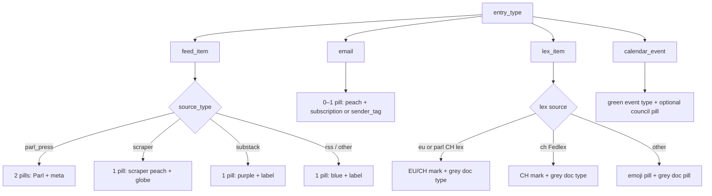

# Seismo timeline entry pills — spec for Magnitu

This document describes the **top-left source label(s)** on Seismo timeline cards so Magnitu can style pulled entries the same way as the mothership dashboard.

The Magnitu **score badge** (top-right, `.magnitu-badge`) is separate and not covered here.

---

## What the pill is

On each timeline card, the label(s) in `.entry-header` identify the **source family** and often the **specific outlet** (feed category, mail sender, lex jurisdiction, etc.).

### Shared base style (all `.entry-tag` pills)

| Property | Value |
|----------|--------|
| Class | `.entry-tag` (+ modifier below) |
| Display | `inline-block` |
| Padding | `0.25rem 0.625rem` (4px × 10px) |
| Border | `0.125rem solid #000000` (2px black) |
| Font | `0.75rem`, weight `500`, color `#000000` |
| Corners | Square (no border-radius) |

Source: `assets/css/style.css` (`.entry-tag` ~line 1805, modifiers ~828–987).

---

## Magnitu API: fields that drive pills

`GET ?action=magnitu_entries` returns a flat list. Every row includes:

| Field | Meaning |
|-------|---------|
| `entry_type` | `feed_item` \| `email` \| `lex_item` \| `calendar_event` |
| `entry_id` | Primary key in that family’s table |
| `source_type` | Family-specific discriminator (see below) |
| `source_category` | Secondary bucket (category, doc type, sender tag, event type, …) |
| `source_name` | Human name (feed title, sender display, lex catalogue name, …) |

Shaping lives in `src/Controller/MagnituController.php`:

- `shapeFeedItem()`
- `shapeEmail()`
- `shapeLexItem()`
- `shapeCalendarEvent()`

### Known API gap (email)

The dashboard prefers `email_subscriptions.display_name` for the pill text. The API does **not** export that field today — only `source_name` (from name/email) and `source_category` (`sender_tags.tag`, default `unclassified`). For labels like “Admin.ch”, use `source_name` when it matches, or coordinate an API extension (e.g. `source_label`).

---

## Decision tree



---

## 1. `feed_item` (RSS, Substack, scraper, Parl press)

### Database

| Table | Columns used |
|-------|----------------|
| `feed_items` | `title`, `link`, `guid`, … (pill text not stored on the item) |
| `feeds` | `source_type`, `category`, `title` |

- `feeds.source_type`: `rss` \| `substack` \| `scraper` \| `parl_press`
- `feeds.category`: routing / future classification (e.g. `media`, outlet tags); **not** used for pill text.

Timeline JOIN exposes: `feed_source_type`, `feed_category`, `feed_title` / `feed_name` (both = `feeds.title`).

### Magnitu API

```json
"source_type": "rss" | "substack" | "scraper" | "parl_press",
"source_category": "<feeds.category>",
"source_name": "<feeds.title>"
```

### Pill text (Seismo logic)

**Not `parl_press`:**

1. Pill text = **`source_name`** (`feeds.title`). Ignore `source_category` for display.
2. Truncate at **32 characters** + `…`.

**`parl_press`:** two pills (see below). Uses `feed_items.guid` and `feeds.category` on the dashboard; `guid` is not in the current Magnitu export — coordinate if Magnitu needs SDA vs MM without heuristics.

### CSS by `source_type`

| Condition | CSS class | Background | Pill text |
|-----------|-----------|------------|-----------|
| `source_type === 'substack'` | `entry-tag entry-tag--feed-substack` | `#c5b4d1` | feed title |
| `feeds.category === 'media'` | `entry-tag entry-tag--feed-media` | `#ffc4c4` | feed title |
| `source_type === 'scraper'` | `entry-tag entry-tag--scraper` | `#add8e6` | `🌐 ` + feed title (default “Scraper”) |
| `source_type === 'rss'` (and other non-special) | `entry-tag entry-tag--feed-rss` | `#add8e6` | feed title |
| `source_type === 'parl_press'` | see Parl table | | |

Example: outlet name on light blue = RSS pill (`entry-tag--feed-rss`, `#add8e6`), text from `source_name`.

### `parl_press` (two pills)

| Pill | Class | Background | Text |
|------|-------|------------|------|
| 1 | `entry-tag--parl` | `#f5f562` | `🇨🇭 Parl SDA` if `guid` starts with `parl_sda:` or category `parl_sda`; else `🇨🇭 Parl MM` |
| 2 | `entry-tag--meta` | `#f5f5f5` | SDA: `Session`; MM: commission from `guid` or `Medienmitteilung` |

---

## 2. `email`

### Database

| Table | Columns |
|-------|---------|
| `emails` | `from_email`, `from_name`, `subject`, `derived_title`, … |
| `email_subscriptions` | `display_name` — **preferred pill text on dashboard** |
| `sender_tags` | `tag` — legacy; exported as `source_category` |

### Magnitu API

```json
"source_type": "email",
"source_category": "<sender_tags.tag or 'unclassified'>",
"source_name": "<from_name or from_email>"
```

### Pill (dashboard)

| Condition | Class | Background | Text |
|-----------|-------|------------|------|
| `subscription_display_name` set | `entry-tag--email-sender` | `#FFDBBB` | display name |
| Else if `sender_tag` set and ≠ `unclassified` | same | same | `sender_tag` |
| Else | **no pill** | | |

Example: “Admin.ch” on peach = email pill (`entry-tag--email-sender`, `#FFDBBB`).

---

## 3. `lex_item`

### Database (`lex_items`)

| Column | Role |
|--------|------|
| `source` | `eu`, `ch`, `de`, `fr`, `ch_bger`, `ch_bge`, `ch_bvger`, `parl_mm`, `parl_sda`, … |
| `document_type` | Second label / grey doc line |
| `celex` | Natural key; `parl_mm:` / `parl_sda:` prefixes → Swiss parl lex cards |

### Magnitu API

```json
"source_type": "lex_<source>",
"source_category": "<document_type>",
"source_name": "<catalogue label>"
```

`source_name` mapping (`MagnituController::LEX_SOURCE_LABELS`):

| `source` | `source_name` |
|----------|----------------|
| `eu` | EUR-Lex |
| `ch` | Fedlex |
| `de` | recht.bund.de |
| `fr` | Légifrance |
| `ch_bger` | Bundesgericht |
| `ch_bge` | BGE |
| `ch_bvger` | Bundesverwaltungsgericht |

### Layout variants

**A — EU lex or Swiss parl lex** (`source === 'eu'`, or celex/guid indicates parl):

- **Mark** (not `.entry-tag`): `.entry-lex-eu-mark` or `.entry-lex-ch-mark`
  - Background `#fff2a8`, 2px black border, bold `0.75rem`, flag emoji + `EU` / `CH`
- **Doc type**: `.entry-lex-eu-doc-type` — color `#666666`, `0.85rem`, weight 500 (plain text, not a bordered pill)

**B — Fedlex** (`source === 'ch'`, non-parl): `.entry-lex-ch-mark` + grey doc type (same as A).

**C — Other lex** (DE, FR, Jus BGer/BGE/BVGer, …): two `.entry-tag` pills:

| Pill | Class | Background | Text |
|------|-------|------------|------|
| Jurisdiction | `entry-tag--lex-source` | `#f5f562` | emoji + short label (see dashboard map) |
| Doc type | `entry-tag--lex-doc` | `#f5f5f5` | `document_type` |

Dashboard jurisdiction map (`views/partials/dashboard_entry_loop.php`):

| `source` | Emoji | Label |
|----------|-------|-------|
| `ch_bger` | ⚖️ | BGer |
| `ch_bge` | ⚖️ | BGE |
| `ch_bvger` | ⚖️ | BVGer |
| `de` | 🇩🇪 | DE |
| `ch` | 🇨🇭 | CH |
| `fr` | 🇫🇷 | FR |
| default | 🇪🇺 | EU |

---

## 4. `calendar_event` (Leg)

### Database (`calendar_events`)

| Column | Pill role |
|--------|-----------|
| `event_type` | First pill (mapped label) |
| `council` | Second pill if set |
| `source` | Usually `parliament_ch` |

### Magnitu API

```json
"source_type": "leg_<normalized_source>",
"source_category": "<event_type>",
"source_name": "Parliament CH" | …
```

### Pills

| Pill | Class | Background | Text |
|------|-------|------------|------|
| Event type | `entry-tag--leg-type` | `#d4edda` | `seismo_calendar_event_type_label(event_type)` |
| Council (optional) | `entry-tag--leg-council` | `#e2e3f1` | `seismo_council_label(council)` |

Council codes from Parlament.ch (e.g. `NR` → Nationalrat, `SR` → Ständerat, `BR` → Bundesrat). See `views/helpers.php`.

---

## Colour quick reference (cards + filter page)

| CSS class | Hex | Used for |
|-----------|-----|----------|
| `entry-tag--feed-rss` / `filter-pill-text--feed` | `#add8e6` | RSS / default feeds |
| `entry-tag--feed-substack` / `filter-pill-text--feed-substack` | `#c5b4d1` | Substack |
| `entry-tag--feed-media` / `filter-pill-text--feed-media` | `#ffc4c4` | Media module (light red) |
| `entry-tag--scraper` / `filter-pill-text--scraper` | `#add8e6` | Scraper (`🌐` prefix in UI) |
| `entry-tag--email-sender` / `filter-pill-text--mail` | `#ffdbbb` | Email |
| `entry-tag--parl` | `#f5f562` | Parl press primary |
| `entry-tag--lex-source` / `filter-pill-text--lex` | `#f5f562` | Lex jurisdiction (non-EU/CH-mark) |
| `entry-tag--meta` | `#f5f5f5` | Secondary grey pills |
| `entry-tag--lex-doc` | `#f5f5f5` | Lex document type |
| `entry-tag--leg-type` / `filter-pill-text--leg` | `#d4edda` | Leg event type |
| `entry-tag--leg-council` | `#e2e3f1` | Leg council |
| `entry-lex-eu-mark` / `entry-lex-ch-mark` | `#fff2a8` | EU/CH jurisdiction chip |

Filter pills use the same `--seismo-pill-*` tokens; they are square like cards but stay compact on `?action=filter`.

---

## Implementation sketch (Magnitu)

```javascript
function labelFromCategoryOrTitle(category, title) {
  const c = (category || '').trim();
  if (c && c !== 'unsortiert') return c;
  return (title || '').trim();
}

function truncateLabel(s, max = 32) {
  if (s.length <= max) return s;
  return s.slice(0, max) + '…';
}

function feedPill(entry) {
  const st = entry.source_type;
  if (st === 'parl_press') {
    return {
      pills: [
        { css: 'entry-tag entry-tag--parl', text: '…' }, // needs guid/category
        { css: 'entry-tag entry-tag--meta', text: '…' },
      ],
    };
  }
  if (st === 'scraper') {
    return {
      css: 'entry-tag entry-tag--scraper',
      text: '🌐 ' + (entry.source_name || 'Scraper'),
    };
  }
  const label = truncateLabel(entry.source_name || '');
  const isMedia = (entry.source_category || '').toLowerCase() === 'media';
  const css = isMedia
    ? 'entry-tag entry-tag--feed-media'
    : st === 'substack'
      ? 'entry-tag entry-tag--feed-substack'
      : st === 'scraper'
        ? 'entry-tag entry-tag--scraper'
        : 'entry-tag entry-tag--feed-rss';
  return { css, text: label };
}

function emailPill(entry) {
  const tag = (entry.source_category || '').trim();
  const name = (entry.source_name || '').trim();
  if (tag === 'unclassified' && !name) return null;
  return {
    css: 'entry-tag entry-tag--email-sender',
    text: name || tag, // prefer subscription display_name when API adds it
  };
}
```

Apply base `.entry-tag` styles (padding, 2px black border, 12px font) on every pill.

---

## Source files in Seismo

| Concern | Location |
|---------|----------|
| Card rendering | `views/partials/dashboard_entry_loop.php`, `entry_card_rss_substack.php`, `entry_card_scraper.php` |
| CSS | `assets/css/style.css` (search `entry-tag`) |
| API contract | `src/Controller/MagnituController.php` |
| DB schema | `docs/db-schema.sql` |

---

## Coordination / future API fields

1. **`source_label` (email)** — export `email_subscriptions.display_name` when matched.
2. **`guid` (feed_item)** — needed for reliable `parl_press` SDA vs MM without guessing from title.
3. **Score badge** — separate from source pills; classes `magnitu-badge-*` by relevance band.
