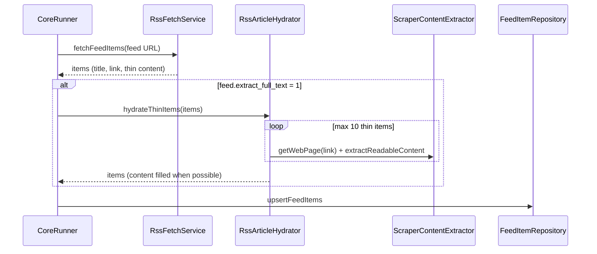

# RSS full-text hydration

Reference map for thin RSS feeds (e.g. Google News) and how they relate to Lex, Leg, Scraper, and the **Media** module.

For the Media admin page (`?action=media`), see [media-module.md](media-module.md).

## Three separate problems

| Problem | Symptom | Fix (which PR) |
|---------|---------|----------------|
| **A — Thin body** | Headline-only cards, weak scoring | Optional **article hydration** after RSS parse (**PR 1**, this doc) |
| **B — Slow discovery** | Headlines appear long after Lex/Leg | Tune **CoreRunner** RSS throttle/chunks (**PR 2**, not in PR 1) |
| **C — Known outlet, full text** | You control the site structure | **Scraper** module (already exists) |

Do not mix PR 1 with VPS throttle changes in one release.

---

## Pipelines today

```
refresh_cron.php
    └── RefreshAllService
            ├── CoreRunner  → RSS / Substack / parl_press / scraper / mail
            └── Plugins     → Lex (recht.bund, Légifrance, …), Leg (parlament.ch), …
```

| Path | Discovers via | Full text via | Table |
|------|---------------|---------------|-------|
| RSS / Substack | `RssFetchService` (XML only) | Feed XML, or **hydrator** if enabled | `feed_items` |
| Scraper | Listing URL + link pattern | `ScraperFetchService` → `ScraperContentExtractor` | `feed_items` |
| Lex / Leg | API or RSS + dedicated fetchers | Plugin content fetchers | `lex_items` / `calendar_events` |

Lex/Leg are **not** merged into RSS; they only feel “faster” because each run pulls a batch from an API, not because 100+ feed URLs are polled in rotation.

---

## PR 1 — scope (implemented)

**Goal:** For feeds with `extract_full_text = 1`, follow thin items’ article URLs and store readable plain text in `feed_items.content`.

### In scope

| Piece | Location | Role |
|-------|----------|------|
| Schema | `feeds.extract_full_text` TINYINT, migration 024 | Per-feed toggle |
| Admin | Feeds → edit form checkbox | Operator enables for Google News–style feeds |
| Hydrator | `src/Core/Fetcher/RssArticleHydrator.php` | HTTP + existing `ScraperContentExtractor` |
| Orchestration | `CoreRunner` | After `RssFetchService::fetchFeedItems`, before `upsertFeedItems` |
| Persist | `FeedItemRepository::upsertFeedItems` | SQL only — unchanged contract |
| Export/import | `SourceConfigImportRepository` | Column preserved on JSON import |
| Tests | `tests/RssArticleHydratorTest.php` | Caps / skip logic without live HTTP |

### Behaviour

1. RSS parse unchanged (`RssFetchService`).
2. If `extract_full_text` and plain body &lt; **400** chars → `GET` article `link` via `BaseClient` (redirects followed).
3. Run HTML through **`ScraperContentExtractor`** (same Readability stack as Scraper).
4. On success: replace `content`; leave RSS `description` unless you later want synopsis sync.
5. On failure: keep thin RSS text; log; do not fail the whole feed.
6. **Cap:** max **10** hydrations per feed per refresh.
7. **Politeness:** **250 ms** `usleep` between consecutive requests to the **same host**.

### Out of scope (later PRs)

- Lowering `CoreRunner` RSS throttle / larger chunks (**PR 2**).
- Backfill script for existing `feed_items` rows.

### Google News RSS

Topic feeds (`news.google.com/rss/...`) point at Google wrapper URLs. Hydration resolves them to the publisher (e.g. `nzz.ch`) before article fetch. If resolution fails, add **direct outlet RSS** (e.g. `https://www.nzz.ch/startseite.rss`) on Media instead of a Google News search feed.

---

## PR 1 — data flow



---

## Layer rules (do not break)

| Do | Don’t |
|----|--------|
| HTTP + extraction in `RssArticleHydrator` | HTTP in `FeedItemRepository` |
| Reuse `ScraperContentExtractor` | Duplicate Readability in a second wrapper |
| Toggle on `feeds` row | Global “hydrate everything” without cap |

---

## When to use what

| Source | Recommendation |
|--------|----------------|
| Google News topic RSS | RSS + **Extract full text** enabled |
| Publisher full-text RSS | RSS only, flag **off** |
| One news section / listing page | **Scraper** |
| BGBl / Légifrance / Parlament | **Lex / Leg** plugins |

---

## Rollback (PR 1)

1. Uncheck **Extract full text** on affected feeds, or set `extract_full_text = 0` in SQL.
2. Re-deploy previous tag if needed; migration 024 is additive (column can stay).
3. Existing thin rows are unchanged until the next successful hydration upsert.

---

## Risk (PR 1)

| Risk | Mitigation |
|------|------------|
| Publisher blocks VPS IP | Cap + per-host delay; keep RSS snippet on failure |
| Cron runtime grows | 10 fetches max per feed per tick |
| Paywall / consent pages | No body extracted; headline remains |
| `content_hash` changes when body fills | Expected; `published_date` preserved when hash unchanged per upsert rule |

**Satellite impact:** none — ingest runs on mothership only.
